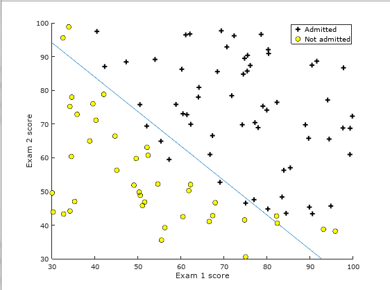
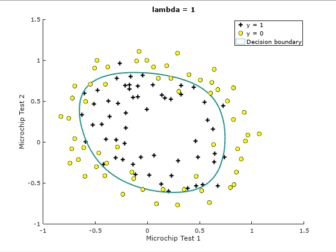

# MachineLearningLogisticRegression
Logisitic Regression &amp; Regularized Logistic Regression

Implementation of logistic regression on 2 sets of data. 

For the first set of data, the cost function and the gradient is calculated and used as input to the Octave funtion fminunc() in order to determine the optimal theta rather than performing gradient descent.  fmuninc() is a faster and more sophisticated way to optimize theta based on gradient search algorithm.

**Logistic Regression using fminunc()**
 
 
 

Regularized Logistic Regression was usind on the 2nd set of data to avoid overfitting to training data.  Once again the cost functin and gradient were calculated, but this time with the regulariztion terms and used as inputs to the fminunc() function in Octave.

**Regularized Logistic Regression**
 

Starter Code provided by Stanford for the course Maching Learning taught by Andrew Ng through Coursera.
